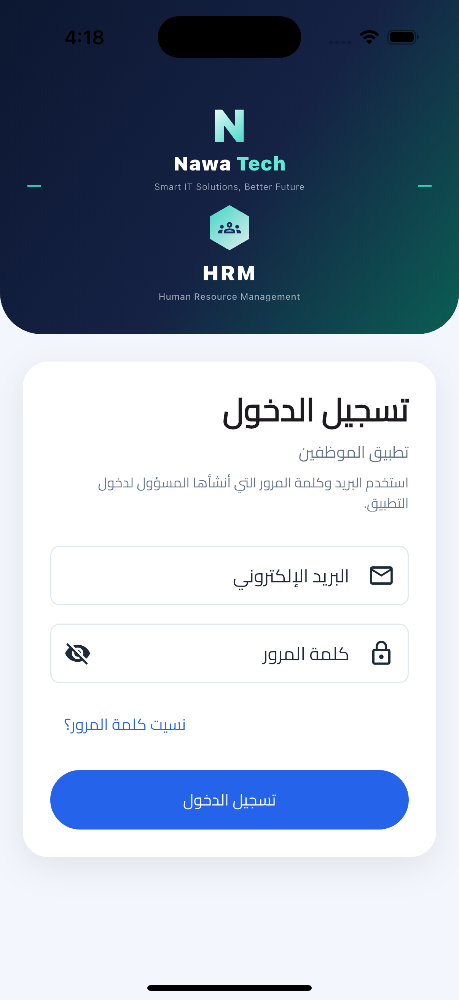

# Nawa Tech HRM — Full-Stack Portfolio Project
# Nawa Tech HRM — مشروع Full-Stack للـ Portfolio

[](https://github.com/ahmedehab96-c/hrm-nawa-tech/actions/workflows/backend_ci.yml)
[](https://github.com/ahmedehab96-c/hrm-nawa-tech/actions/workflows/flutter_ci.yml)

> **Full-Stack HR Management with AI** | **نظام إدارة موارد بشرية متكامل مع ذكاء اصطناعي**

## At a glance | نظرة سريعة

| | |
|---|---|
| **Purpose** | Portfolio case study — full-stack HR platform with SaaS-ready architecture |
| **My role** | Solo: Laravel API, Filament admin, Flutter mobile, tests, CI, Docker, i18n |
| **Stack** | Laravel 13 · Filament 5 · Flutter 3 · Sanctum · SQLite/MySQL · GitHub Actions |
| **Proof** | 120+ backend tests · 80+ Flutter tests · [Architecture](./docs/ARCHITECTURE.md) · [Demo guide](./DEMO.md) · [Portfolio summary](./docs/PORTFOLIO.md) |
| **Run locally** | `./scripts/start_api.sh` → http://127.0.0.1:8000/admin |
| **Live demo** | [docs/LIVE_DEMO.md](./docs/LIVE_DEMO.md) — Railway HTTPS URL for recruiters |

### Live demo | تجربة مباشرة

Public hosted demo (after Railway deploy): see **[docs/LIVE_DEMO.md](./docs/LIVE_DEMO.md)**.

Until the public URL is live, run locally:

```bash
./scripts/start_api.sh
# Admin → http://127.0.0.1:8000/admin
# Recruiter → recruiter@demo.com / Recruiter12345!
```

### Mobile preview



More portfolio captures are tracked in [`docs/screenshots/`](./docs/screenshots/README.md).

**Portfolio case study:** A production-minded HR platform demonstrating full-stack product development across Laravel, Filament, Flutter, REST APIs, multi-tenancy, RBAC, testing, CI, Docker, and AI-assisted workflows.

**دراسة حالة للـ Portfolio:** منصة موارد بشرية توضح بناء منتج Full-Stack باستخدام Laravel وFilament وFlutter وREST API، مع تعدد الشركات والصلاحيات والاختبارات وCI وDocker وميزات مدعومة بالذكاء الاصطناعي.

**Current stage:** Portfolio-ready demo with SaaS foundations. Live payment processing, production hosting, observability, and final security hardening remain roadmap items—not finished claims.

**المرحلة الحالية:** عرض Portfolio قابل للتجربة مع أساس قوي للتحول إلى SaaS. الدفع الحقيقي والنشر الإنتاجي والمراقبة والمراجعة الأمنية النهائية ما زالت ضمن خارطة الطريق.

📖 **Architecture:** [docs/ARCHITECTURE.md](./docs/ARCHITECTURE.md) · **Demo:** [DEMO.md](./DEMO.md) · **Live demo:** [docs/LIVE_DEMO.md](./docs/LIVE_DEMO.md) · **SaaS launch:** [SAAS.md](./SAAS.md)  
🚀 **Deploy:** [DEPLOY.md](./DEPLOY.md)

---

## Why this project matters | لماذا هذا المشروع؟

This is not a CRUD-only sample. It demonstrates:

- A clear product split: **Filament web admin**, **Flutter employee app**, and **Laravel API**
- Tenant isolation through `company_id`, company onboarding, trials, and plan limits
- Role-based access for platform admins, company admins, HR managers, recruiters, and employees
- Real HR workflows: attendance, leave decisions, payroll, performance, recruitment, and reports
- Arabic/English administration with RTL/LTR and dark mode
- Automated backend and Flutter tests, GitHub Actions, Docker, queues, scheduler, and health checks
- AI-assisted recruitment, leave recommendations, performance analysis, and report generation with safe fallbacks

المشروع ليس CRUD فقط؛ بل يعرض فصل الواجهات، تعدد الشركات، الصلاحيات، عمليات HR حقيقية، تطبيق موظفين، اختبارات، CI/CD، Docker، وميزات AI قابلة للتعطيل عند غياب المزود.

> For a focused 5–10 minute reviewer walkthrough, use [DEMO.md](./DEMO.md).

---

## 🎮 Try the platform | جرّب المنصة

### English — Step by step

#### Option A — Free trial (SaaS)

1. Start Laravel (see below)
2. Register via API: `POST http://127.0.0.1:8000/api/register`
3. Sign in to Filament admin at **`http://127.0.0.1:8000/admin`**

#### Option B — Demo account (no signup)

#### Prerequisites
- Flutter 3.x (employee mobile)
- PHP 8.3+ with `intl` & Composer (use `php@8.4` on Homebrew if needed)
- iOS Simulator or Android emulator

#### 1. Start Laravel (API + Admin)

```bash
git clone https://github.com/ahmedehab96-c/hrm-nawa-tech.git
cd hrm-nawa-tech
./scripts/start_api.sh
```

Or manually:

```bash
cd backend
composer install
cp .env.example .env
php artisan key:generate
php artisan migrate:fresh --seed
php artisan serve
```

✅ API: **`http://127.0.0.1:8000/api`**
✅ Admin (Filament): **`http://127.0.0.1:8000/admin`**

#### 2. Open Admin Dashboard (Web)

- Open **`http://127.0.0.1:8000/admin`**
- Login with demo admin, or platform account for companies

| Role | Email | Password |
|------|-------|----------|
| **Admin** | `admin@demo.com` | `Admin12345!` |
| **Platform** | `platform@nawatech.com` | `Platform12345!` |
| **HR manager** | `hr@demo.com` | `HrManager12345!` |
| **Recruiter** | `recruiter@demo.com` | `Recruiter12345!` |

For mail and AI background jobs locally, run `./scripts/start_queue.sh` in a second terminal. Verify the stack with `./scripts/smoke_test.sh`.

#### 3. Run Employee App (Mobile)

```bash
flutter pub get
flutter run -d ios        # iPhone Simulator
# or
flutter run -d android  # Android Emulator
```

In **debug mode**, simulators auto-connect to the local API (`127.0.0.1` on iOS, `10.0.2.2` on Android emulator).

Or open **Profile** → **Server (Laravel API)**:
1. Enable **Use server**
2. Set Base URL: `http://127.0.0.1:8000/api`
3. Save

| Role | Email | Password |
|------|-------|----------|
| **Employee** | `emp01@demo.com` | `Employee12345!` |
| Employee 2 | `emp02@demo.com` | `Employee12345!` |

> On a **physical device**, use your computer's LAN IP instead of `127.0.0.1`  
> Example: `http://192.168.1.10:8000/api`

#### 4. What to explore

| Area | Highlights |
|------|------------|
| **Filament Admin** | Employees, attendance, leave, payroll, jobs |
| **Companies (platform)** | Super-admin tenant management |
| **Employee mobile** | Attendance, leave, payslip, notifications |
| **AI / API** | Assistant, recruitment, reports via `/api` |

#### 5. App icon

The mobile app uses the **HRM logo** (not the default Flutter icon).  
After icon changes, **uninstall and reinstall** the app on the simulator/device to see the new icon.

---

### العربية — خطوة بخطوة

#### المتطلبات
- Flutter 3.x (تطبيق الموظف)
- PHP 8.3+ مع `intl` و Composer
- محاكي iOS أو Android

#### 1. تشغيل Laravel (API + لوحة الأدمن)

```bash
git clone https://github.com/ahmedehab96-c/hrm-nawa-tech.git
cd hrm-nawa-tech
./scripts/start_api.sh
```

✅ الـ API: **`http://127.0.0.1:8000/api`**
✅ لوحة الأدمن (Filament): **`http://127.0.0.1:8000/admin`**

#### 2. فتح لوحة الإدارة (ويب)

- افتح **`http://127.0.0.1:8000/admin`**
- سجّل دخول الأدمن أو حساب المنصة

| الدور | البريد | كلمة المرور |
|-------|--------|-------------|
| **أدمن** | `admin@demo.com` | `Admin12345!` |
| **المنصة** | `platform@nawatech.com` | `Platform12345!` |
| **مدير HR** | `hr@demo.com` | `HrManager12345!` |
| **توظيف** | `recruiter@demo.com` | `Recruiter12345!` |

للبريد ومهام AI في الخلفية: `./scripts/start_queue.sh` في طرفية ثانية. للتحقق: `./scripts/smoke_test.sh`.

#### 3. تشغيل تطبيق الموظف (موبايل)

```bash
flutter pub get
flutter run -d ios        # محاكي iPhone
# أو
flutter run -d android    # محاكي Android
```

في **وضع التطوير**، المحاكي يتصل تلقائياً بالـ API المحلي (`127.0.0.1` على iOS، `10.0.2.2` على Android).

أو افتح **الملف الشخصي** → **الخادم (Laravel API)**:
1. فعّل **استخدام الخادم**
2. ضع العنوان: `http://127.0.0.1:8000/api`
3. احفظ

| الدور | البريد | كلمة المرور |
|-------|--------|-------------|
| **موظف** | `emp01@demo.com` | `Employee12345!` |
| موظف 2 | `emp02@demo.com` | `Employee12345!` |

> على **هاتف حقيقي**، استخدم IP جهازك على الشبكة بدلاً من `127.0.0.1`  
> مثال: `http://192.168.1.10:8000/api`

#### 4. ماذا تجرب؟

| القسم | أبرز المميزات |
|-------|----------------|
| **لوحة Filament** | موظفون، حضور، إجازات، رواتب، وظائف |
| **الشركات (المنصة)** | إدارة المستأجرين لـ super_admin |
| **تطبيق الموظف** | حضور، إجازات، قسيمة راتب، إشعارات |
| **AI / API** | المساعد والتقارير عبر `/api` |

#### 5. أيقونة التطبيق

تطبيق الموبايل يستخدم **شعار HRM** (وليس أيقونة Flutter الافتراضية).  
بعد تغيير الأيقونة، **احذف التطبيق وأعد تثبيته** على المحاكي/الهاتف لرؤية الأيقونة الجديدة.

---

## 🚀 SaaS evolution roadmap | خارطة التحول إلى SaaS

> **Current status:** The repository includes SaaS foundations—multi-tenant trials, plan limits, a platform console, and a billing integration scaffold. It is not presented as a finished commercial service.

> **الوضع الحالي:** يحتوي المشروع على أساس SaaS مثل تعدد الشركات والتجارب وحدود الخطط ولوحة المنصة وهيكل الفوترة، لكنه لا يُقدّم كخدمة تجارية مكتملة بعد.

### Already shipping | ما يعمل الآن

| Capability | Status |
|------------|--------|
| Multi-tenant (`company_id` isolation) | ✅ |
| Company self-registration + 14-day trial | ✅ |
| Email verification gate | ✅ |
| Plan employee caps (trial / starter / growth / enterprise) | ✅ |
| Super-admin companies (Filament) | ✅ |
| Billing integration scaffold | ✅ scaffold, not live payments |
| Filament Admin Web + Flutter Employee Mobile | ✅ |
| RBAC (roles & permissions) + `super_admin` | ✅ |
| AI features + governance | ✅ |
| Optional MySQL Docker profile | ✅ |
| Arabic + English (RTL/LTR) on admin and mobile | ✅ |

### Still planned | المتبقي

| Phase | Feature |
|-------|---------|
| **Next** | Public demo deployment with seeded, resettable data |
| **Next** | Live Stripe / Moyasar checkout and production webhook verification |
| **Next** | Monitoring, backups, rate-limit review, and external security review |
| **Later** | Custom domains, tenant branding, and production SaaS operations |

```
Earlier portfolio demo          SaaS product (now → launch)
─────────────────────           ──────────────────────────
1 showcase tenant      →        Many companies + trials
Login showcase         →        Register + plan upgrades
nawatech.com/portfolio →        hrm.nawatech.com (planned)
```

### Changelog — July 2026 | سجل التغييرات — يوليو 2026

**English**
- SaaS trial onboarding (register → 14-day trial + demo employees)
- Email verification + plan employee limits
- Platform console for super-admin (overview, suspend/activate, extend trial, manual plans)
- Billing scaffold (`POST /billing/checkout`) + Settings upgrade CTAs
- Suspended-company API gate (`company_suspended`)
- Optional MySQL via `docker compose --profile mysql`
- AppStrings localization (replaced flutter gen-l10n)
- MVVM foundation for Platform console and Login

**العربية**
- تسجيل شركة مع تجربة 14 يوماً + موظفين تجريبيين
- التحقق من البريد + حدود عدد الموظفين حسب الخطة
- لوحة المنصة لـ super_admin (نظرة عامة، تعليق/تفعيل، تمديد تجربة، تفعيل خطط يدوياً)
- هيكل الفوترة + أزرار الترقية في الإعدادات
- منع الشركات المعلّقة عبر الـ API
- MySQL اختياري عبر Docker profile
- ترجمة عبر `AppStrings` بدل gen-l10n
- أساس MVVM للوحة المنصة وتسجيل الدخول

---

## 🎯 Features | المميزات

### Admin Panel (Web) | لوحة الأدمن

Dashboard · Employees · Attendance · Leave · Payroll · Recruitment · AI Command Center · Performance · Reports · Settings · Platform (super_admin)

### Employee App (Mobile) | تطبيق الموظف

Home · Attendance · Leave · Payslip · Profile · Notifications

---

## 🏗️ Architecture | المعمارية

```
hrm-nawa-tech/
├── backend/
│   ├── app/Filament/    # Admin panel, resources, pages, widgets
│   ├── app/Http/        # REST API controllers and middleware
│   ├── app/Services/    # HR, billing, onboarding, AI, platform services
│   └── tests/           # Laravel feature and unit tests
├── lib/
│   ├── core/            # API client, auth, routing, shared services
│   └── features/        # Employee-facing Flutter feature modules
├── test/                # Flutter widget/unit tests
├── docs/                # PORTFOLIO.md + screenshots checklist
├── scripts/             # Local startup, queue, scheduler, smoke tests
└── .github/workflows/   # Backend and Flutter CI
```

---

## 🛠️ Tech Stack | التقنيات

| Layer | Stack |
|-------|-------|
| **Admin web** | Laravel Filament 5, Cairo UI, AR/EN, RTL/LTR, dark mode |
| **Employee mobile** | Flutter 3, GoRouter, secure storage, AR/EN |
| **Backend** | Laravel 13, Sanctum, queues, scheduler, SQLite/MySQL |
| **AI** | OpenAI / Gemini gateway, prompt registry |
| **Engineering** | Multi-tenancy, RBAC, service layer, CI, Docker, automated tests |

---

## 🧪 Tests | الاختبارات

```bash
cd backend && php artisan test
flutter test
```

Current local verification:

- **Backend:** 121 tests, 415 assertions
- **Flutter:** 38 tests
- **Static analysis:** `dart analyze` passes with no issues
- **CI:** independent GitHub Actions workflows for backend and Flutter

---

## 👨‍💻 Developer | المطوّر

**Ahmed Ehab Mohammed — Nawa Tech**  
📧 ahmed96it96@gmail.com  
🌐 [nawatech.com](https://nawatech.com)  
💻 [GitHub — hrm-nawa-tech](https://github.com/ahmedehab96-c/hrm-nawa-tech)

---

## 📄 License

MIT — see [LICENSE](./LICENSE). Portfolio use is encouraged; contact the author for commercial SaaS licensing.
